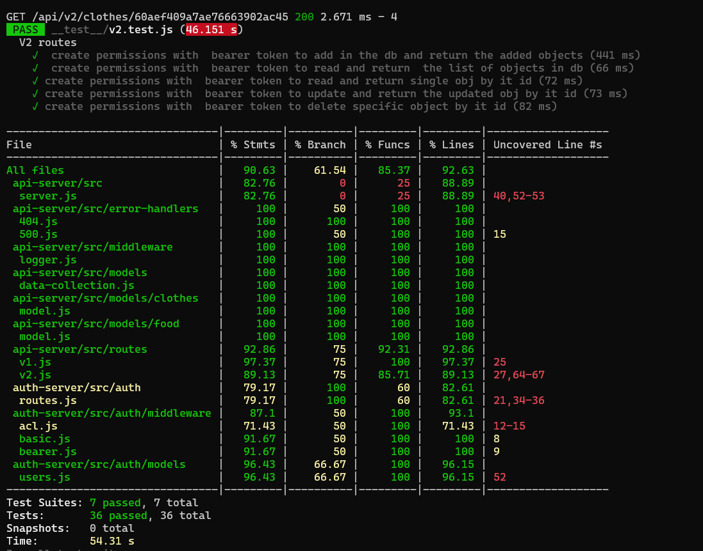

# auth-api


## Author: As-har Abuhelweh

* [Tests Report](https://github.com/asharabuhelweh/auth-api/actions)

* [Heroku Deployment](https://ashar-uth-api.herokuapp.com/)

* [Pull Request](https://github.com/asharabuhelweh/auth-api/pull/3)

<hr>

### Setup

1. Clone the repo

2. npm init -y.

3. npm install 

4. Create .env file with PORT=5000 ,SECRET

5. Test --> `npm test`


## Endpoints: 

post `/signin`

post `/signup`

get `/users`

get `/secret`


CRUD `/api/v1/food` 

CRUD `/api/v2/food` 

CRUD `/api/v1/clothes` 

CRUD `/api/v2/clothes` 


## Returns Object

  ```js
  user {
    "_id": "String",
    "username": "String",
    "password": "String",
    "role": "String"
  }

```
 ```js
foodModel {
    name: String,
    calories: Number,
    type: enum
}
```
```js

clothesModel {
    name: String,
    color: String,
    size: String
}
```


## Tests

 `npm test`



## UML


